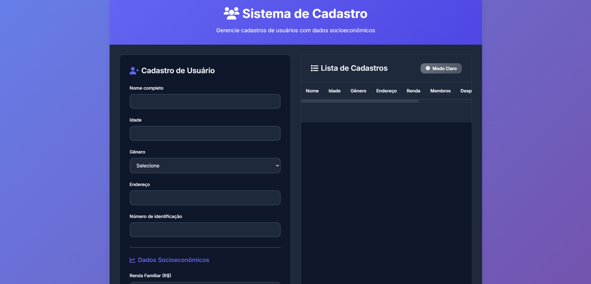
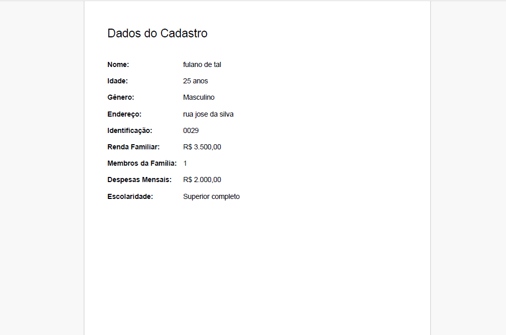

# 📝 Sistema de Cadastro de Usuários Simples

## 📌 Descrição

Projeto desenvolvido com **HTML**, **CSS moderno** e **JavaScript puro**, com o objetivo de criar um sistema intuitivo de cadastro de pessoas, com foco em programas sociais ou uso interno de organizações.

### Funcionalidades principais:

- ✅ Cadastro de dados pessoais e socioeconômicos
- ✅ Edição, exclusão e listagem dinâmica
- ✅ Geração de PDF individual e da lista completa
- ✅ Interface moderna com **modo claro/escuro**
- ✅ Responsivo para dispositivos móveis

---

## 🚀 Funcionalidades em ação

### 📄 Formulário de Cadastro (Modo Claro)

---

### 🌑 Modo Escuro

---

### 📋 Lista de Cadastros com Ações

---

### 📥 PDF Gerado

---

## 🛠️ Tecnologias Utilizadas

- **HTML5** – Estrutura da aplicação  
- **CSS3** – Estilo moderno com responsividade  
- **JavaScript (ES6)** – Lógica de interação e armazenamento  
- **[jsPDF](https://github.com/parallax/jsPDF)** – Biblioteca para geração de PDFs  
- **localStorage** – Armazenamento local de dados  

---

## 📚 Como Usar

1. Baixe ou clone este repositório.
2. Abra o arquivo `index.html` no seu navegador.
3. Preencha o formulário e clique em **Cadastrar**.
4. Veja os dados serem exibidos na tabela abaixo.
5. Utilize os botões para **editar**, **excluir** ou **baixar PDF individual**.
6. Clique em **“Baixar lista como PDF”** para exportar todos os cadastros.

---

